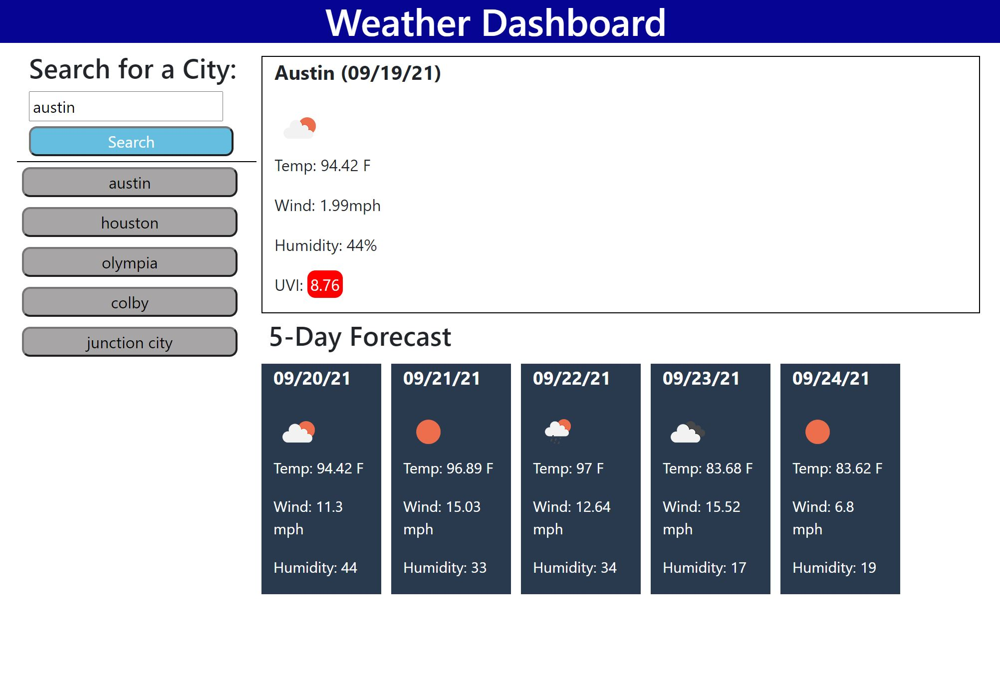

# Weather Forecast Site-Server-Side APIs

## Description

This project is a basic weather forecast site. The site uses Open Weather Maps APIs that allow one to search by city in order to see the current weather and a five day forecast.

The project demonstrates the use of HTML, CSS, Javascript, jQuery, Moment.js, and server-side APIs. The project required creating a basic skeleton with HTML, which was then populated through Javascript.

When a user types a city into the search box, the site fetches a response from the Open Weather Maps Current Weather Data API. This response gives latitude and longitude of the city, which is then input into the fetch for data from their One Call API. This response is then placed into elements on the page, giving the user data such as temperature, wind speed, and humidity. Moment.js provides the current date, as well as the dates for the next five days.

## Installation

You can find the deployed site [here.](https://allysonmcgrath.github.io/cbcchallenge6/)

To install the entire project and access the code, you can clone the repository by using the command prompt

$ git clone https://github.com/AllysonMcGrath/cbcchallenge6.git

Detailed instructions for cloning GitHub repositories can be found [here.](https://docs.github.com/en/github/creating-cloning-and-archiving-repositories/cloning-a-repository-from-github/cloning-a-repository)

## Usage

When displaying correctly, website should look like the image below:

Use standard git commands within this repository.

Examples:

$ git mv index.html ../
$ git add .
$ git commit -m "commit description"
$ git push origin main

## Credits

Trilogy Education Services, LLC, a 2U, Inc. brand

[Coding Boot Camp at UT](https://github.com/the-Coding-Boot-Camp-at-UT)

[jQuery](https://jquery.com/)

[Moment.js](https://momentjs.com/)

[Bootstrap](https://getbootstrap.com/)

[Open Weather Map: Current Weather Data](https://openweathermap.org/current)

[Open Weather Map: One Call API](https://openweathermap.org/api/one-call-api)

## License

MIT License

Copyright (c) 2021 Allyson McGrath

Permission is hereby granted, free of charge, to any person obtaining a copy
of this software and associated documentation files (the "Software"), to deal
in the Software without restriction, including without limitation the rights
to use, copy, modify, merge, publish, distribute, sublicense, and/or sell
copies of the Software, and to permit persons to whom the Software is
furnished to do so, subject to the following conditions:

The above copyright notice and this permission notice shall be included in all
copies or substantial portions of the Software.

THE SOFTWARE IS PROVIDED "AS IS", WITHOUT WARRANTY OF ANY KIND, EXPRESS OR
IMPLIED, INCLUDING BUT NOT LIMITED TO THE WARRANTIES OF MERCHANTABILITY,
FITNESS FOR A PARTICULAR PURPOSE AND NONINFRINGEMENT. IN NO EVENT SHALL THE
AUTHORS OR COPYRIGHT HOLDERS BE LIABLE FOR ANY CLAIM, DAMAGES OR OTHER
LIABILITY, WHETHER IN AN ACTION OF CONTRACT, TORT OR OTHERWISE, ARISING FROM,
OUT OF OR IN CONNECTION WITH THE SOFTWARE OR THE USE OR OTHER DEALINGS IN THE
SOFTWARE.
